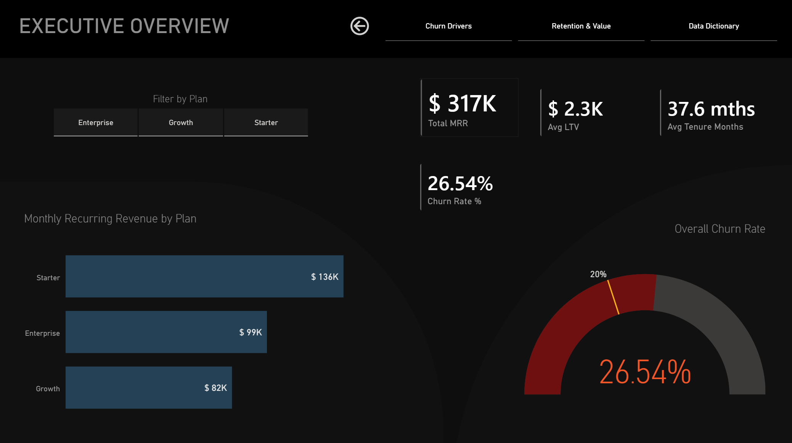
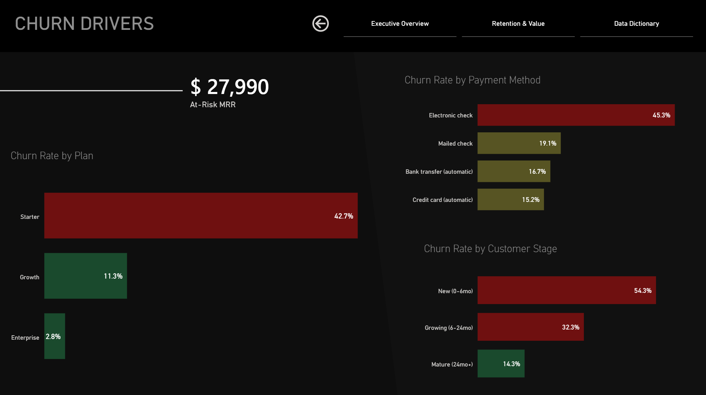
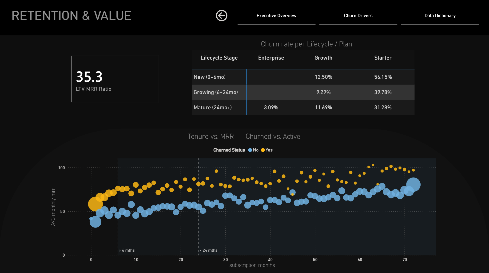
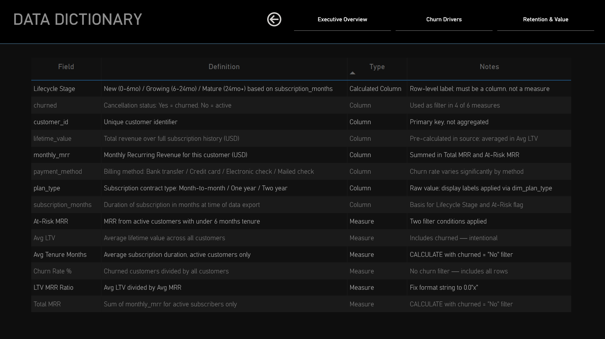

# TechFlow SaaS Analytics

> **TechFlow's highest-paying customers are its most likely to churn — and most of them leave before month 6.** This end-to-end analysis identifies where revenue is bleeding, which customer segments are driving it, and whether a new landing page would have moved the needle.

[View Interactive Report](https://app.powerbi.com/view?r=eyJrIjoiZTg1NGUwYTQtYWMzZC00NDU5LWEzMjEtNGM0YmJhNzM5Mzk4IiwidCI6ImM5YTM3Nzk4LTFjNGQtNDY2Ni04YTczLTMzY2M2MzE0ZmVmZSJ9&pageName=22d7cd70592551b080c6)


<details>
<summary>Table of Contents</summary>

- [TechFlow SaaS Analytics](#techflow-saas-analytics)
  - [Problem](#problem)
  - [Approach](#approach)
  - [Key Findings](#key-findings)
  - [A/B Test Result](#ab-test-result)
  - [Strategic Recommendation](#strategic-recommendation)
  - [Dashboard](#dashboard)
  - [Quick Links](#quick-links)

</details>

---

## Problem

TechFlow operates three subscription tiers:
- Starter (month-to-month)
- Growth (annual)
- Enterprise (two-year).  

Leadership needs to understand two things:

1. **Where is revenue leaking, and which customer segments are responsible?**
2. **Would a new onboarding landing page improve conversion enough to justify a full rollout?**

---

## Approach

The analysis follows a SQL-first workflow: every business question is answered at the database layer before any visualization is built. 

Power BI serves stakeholders who need to explore data interactively; the Python-generated Excel report serves those without Power BI access and demonstrates that analytical output can be automated and decoupled from the analyst. 

The notebooks make the statistical reasoning transparent and reproducible.

| Layer | Tool | Purpose |
|---|---|---|
| Data storage | PostgreSQL 16 | Source of truth, all queries run against live DB |
| Exploration & KPIs | Python / pandas / Jupyter | EDA, churn segmentation, cohort analysis |
| A/B test | Python / scipy | Z-test for proportions, effect size, power analysis |
| Executive dashboard | Power BI | 4-page interactive report with DAX measures |
| Automated report | Python / openpyxl | Excel workbook generated from DB, no manual steps |

7,043 customer records. Data sourced from IBM Watson Analytics (Telco Customer Churn dataset), reframed as SaaS subscription analytics.

---

## Key Findings

| Metric | Value |
|---|---|
| Active MRR | $317K |
| Overall Churn Rate | 26.5% |
| At-Risk MRR | $27,990 |
| LTV : MRR Ratio | 35.3x |

**1. Revenue churn exceeds logo churn** — Starter plan drives 42.7% churn overall, 56% among new subscribers. TechFlow is disproportionately losing its highest-paying accounts.

**2. The first 6 months are the highest-leverage window** — over half of new Starter subscribers cancel before month 6. Each retained at-risk customer represents ~$2,283 in lifetime value.

**3. Payment method is a leading churn indicator** — electronic check users churn at 45.3%, three times the rate of credit card users (15.2%). Actionable without touching the product.

---

## A/B Test Result

The new landing page showed no meaningful improvement in conversion. Projected revenue impact at current traffic: **−$1,026/month**. Rollout not recommended — a longer test with tighter segment targeting is the suggested next step.

<details>
<summary>Statistical details</summary>

p = 0.19 (not significant at α = 0.05) · Cohen's h = 0.003 (negligible effect size) · n = 294,478

</details>

---

## Strategic Recommendation

Fix the Starter plan's first 90 days before optimising acquisition. The analysis shows that converting Starter customers into long-tenure subscribers is more financially impactful than improving landing page conversion — because the customers already in the funnel are leaving faster than new ones are coming in. Priority order:

1. Onboarding intervention for Starter customers at day 30 and day 60
2. Auto-payment migration campaign targeting electronic check users
3. Revisit landing page A/B test with a longer run and segmented treatment groups

---

## Dashboard

<details>
<summary><strong>Executive Overview</strong> — KPI cards, MRR by plan, churn rate gauge with 20% benchmark</summary>



</details>

<details>
<summary><strong>Churn Drivers</strong> — Churn rate by plan, payment method, and lifecycle stage</summary>



</details>

<details>
<summary><strong>Retention & Value</strong> — Tenure vs. MRR scatter with lifecycle zone boundaries</summary>



</details>

<details>
<summary><strong>Data Dictionary</strong> — Field definitions, measure logic, filter context</summary>



</details>

---

## Quick Links

| Resource | Link |
|---|---|
| Powerbi Live Report | [View interactive report](https://app.powerbi.com/view?r=eyJrIjoiZTg1NGUwYTQtYWMzZC00NDU5LWEzMjEtNGM0YmJhNzM5Mzk4IiwidCI6ImM5YTM3Nzk4LTFjNGQtNDY2Ni04YTczLTMzY2M2MzE0ZmVmZSJ9&pageName=22d7cd70592551b080c6)
| KPI Analysis Notebook | [01_kpi_analysis.ipynb](notebooks/01_kpi_analysis.ipynb) |
| A/B Test Notebook | [02_ab_test.ipynb](notebooks/02_ab_test.ipynb) |
| SQL Queries | [sql/queries.sql](sql/queries.sql) |
| Excel Dashboard (auto-generated) | [dashboards/techflow_kpi.xlsx](dashboards/techflow_kpi.xlsx) |
| Power BI Report | [dashboards/techflow_saas_analytics_1.Report](dashboards/techflow_saas_analytics_1.Report) |
| IBM Telco Dataset (source) | [IBM GitHub](https://raw.githubusercontent.com/IBM/telco-customer-churn-on-icp4d/master/data/Telco-Customer-Churn.csv) |
| Udacity A/B Test Dataset (source) | [Udacity GitHub](https://raw.githubusercontent.com/marooned20/Udacity-AB-testing/master/ab_data.csv) |

---

<details>
<summary>Metrics & Definitions</summary>

| Field / Measure | Definition | Notes |
|---|---|---|
| `monthly_mrr` | Monthly Recurring Revenue per customer (USD) | Sourced from IBM dataset; maps to `MonthlyCharges` |
| `lifetime_value` | Total revenue over full subscription history (USD) | Pre-calculated in source; maps to `TotalCharges` |
| `subscription_months` | Duration of subscription at time of data export | Maps to `tenure` |
| `plan_type` | Contract tier: Month-to-month / One year / Two year | Display labels: Starter / Growth / Enterprise |
| `churned` | Cancellation status: Yes = churned, No = active | Used as filter in 4 of 6 DAX measures |
| `Lifecycle Stage` | New (0–6mo) / Growing (6–24mo) / Mature (24mo+) | Calculated column; row-level label |
| `Total MRR` | SUM of monthly_mrr, active customers only | CALCULATE with churned = "No" filter |
| `Churn Rate %` | Churned ÷ total customers | No churn filter — includes all rows |
| `At-Risk MRR` | MRR from active customers with < 6 months tenure | Two filter conditions applied |
| `LTV:MRR Ratio` | Avg LTV ÷ Avg MRR | Indicates revenue months generated per customer |

</details>

<details>
<summary>What This Analysis Cannot Tell You</summary>

- **Causality**: The payment method correlation (electronic check → high churn) is associative, not causal. Customers may self-select into payment methods based on factors that independently predict churn.
- **Time dimension**: This is a cross-sectional snapshot. MRR trends, cohort progression, and seasonal patterns require longitudinal data not available in this dataset.
- **Acquisition cost**: Without CAC data, the retention ROI calculation is directional, not precise.
- **Product usage**: Churn drivers are demographic and contractual. No feature usage data is available to identify product-level disengagement signals.
- **A/B test generalisability**: The Udacity dataset is e-commerce, not SaaS. Conversion-to-paid dynamics may differ materially from what TechFlow would observe.

</details>

<details>
<summary>How to Reproduce</summary>

**Requirements:** Docker, Python 3.11+, Power BI Desktop (for .pbix)

```bash
# 1. Start the database and load data
docker run --name techflow -e POSTGRES_PASSWORD=pass -p 5432:5432 -d postgres:16
python tools/setup_db.py

# 2. Regenerate the Excel dashboard
python tools/build_excel.py
```

Notebooks run in Google Colab — no local Jupyter required. Open the links in [Quick Links](#quick-links) and run all cells.

Environment variables: copy `.env.example` to `.env` and set your DB credentials before running any tool.

</details>
